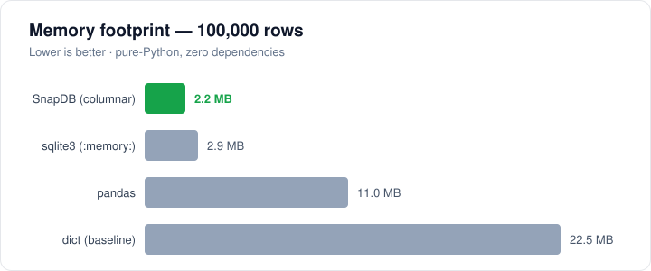

# SnapDB

A lightweight, pure-Python embedded database with a row store and a columnar
analytics engine.

[](https://github.com/hussain-alsaibai/snapdb/actions/workflows/ci.yml)
[](https://pypi.org/project/pysnapdb/)
[](https://www.python.org/)
[](LICENSE)

SnapDB is a zero-dependency embedded database for single-writer, local Python
applications. It stores data in memory-mapped files with precompiled struct
codecs and lightweight column compression, and targets use cases such as test
fixtures, small operational datasets, and embedded analytics where pulling in
SQLite or a compiled extension isn't worth it. It is not a drop-in replacement
for SQLite or DuckDB — see [Roadmap & Known Limitations](#roadmap--known-limitations)
for the design boundaries.

```bash
pip install pysnapdb
```

## Developer Tool Reports

This repo is part of the **OpenClaw developer tools ecosystem** — a curated
collection of lightweight, zero-dependency libraries that power autonomous
agents and developer tooling. SnapDB provides the durable local ledger layer.
For ecosystem status, benchmarks, and cross-library reports, see the
[dev-masterkit developer tool reports](https://github.com/hussain-alsaibai/dev-masterkit/tree/main/reports).

## Why SnapDB for AI Agents?

In 2026, autonomous agents are the primary users of embedded databases. SnapDB is designed specifically for these use cases:

1. **State Snapshotting**: Agents can capture and restore their entire memory state in milliseconds via memory-mapped files.
2. **Context Compression**: Use the columnar engine to perform bulk analysis on agent history and extract the most relevant context for the next prompt.
3. **Audit Trails**: Durable, append-only row storage ensures that every decision and tool call is recorded and survives crashes.
4. **Zero-Dependency Deployment**: Agents often run in restricted environments (sandboxes, edge nodes). SnapDB's single-file, pure-Python nature means it runs anywhere Python runs without complex installations.

## SnapDB for AI Agent Memory

SnapDB is purpose-built for the **durable state** and **audit trail** needs of autonomous AI agents. Here's how it maps to real agent patterns:

### Pattern 1: State Snapshotting

Agents maintain complex in-memory state (conversation history, tool results, pending tasks). SnapDB's memory-mapped snapshots let you atomically save and restore entire agent state in milliseconds — no serialization overhead.

```python
from snapdb import SnapDB

db = SnapDB()
store = db.memory_store("agent_state")

# Agent working state
store.insert(state="planning", current_task="fix-auth-bug", steps_taken=12, tokens_spent=84000)

# Snapshot — save to disk
db.snapshot()

# Agent crashes → restart → restore in <10ms
db.restore()
current = store.all()
print(current[-1])  # back where you left off
```

### Pattern 2: Audit Trail

Every autonomous decision should be logged durably. SnapDB's row store is append-only and crash-safe.

```python
audit = db.row_store("decisions")

audit.insert(
    agent_id="openclaw-main",
    action="open_pr",
    target="hussain-alsaibai/repo#42",
    reasoning="Bug described in issue matches stack trace in error logs",
    outcome="pr_opened",
    timestamp=datetime.now().isoformat()
)

# Query: what did the agent do in the last hour?
recent = audit.select_where("outcome == 'pr_opened'")
```

### Pattern 3: Tool Call Memory

Cache tool results to avoid re-fetching. Columnar engine handles 100K+ entries at full-scan speed.

```python
tool_cache = db.columnar_store("tool_results")

# Columnar for high-throughput reads
tool_cache.create_column("tool", "str")
tool_cache.create_column("args_hash", "str")
tool_cache.create_column("result_preview", "str", max_size=200)
tool_cache.create_column("called_at", "f8")

tool_cache.insert(["fetch_github_issue", "abc123", "..."],
                   ["fetch_github_issue", "def456", "..."])
```

### Pattern 4: Context Compression

Use the columnar analytics engine to compress agent history into summary stats for the next prompt.

```python
# What tools does this agent call most?
top_tools = store.aggregate("tool_name", "count", top_k=5)

# Average tokens per session?
avg_tokens = store.aggregate("tokens_used", "mean")

# Failed operations by type?
failures = store.select_where("outcome == 'error'").group_by("error_type")
```

### Comparison: SnapDB vs Alternatives for Agent Memory

| Feature | SnapDB | SQLite | Redis | DuckDB |
|---------|--------|--------|-------|--------|
| Zero-dependency | ✅ | ✅ | ❌ | ❌ |
| Memory-mapped snapshots | ✅ | ❌ | N/A | ❌ |
| Columnar analytics | ✅ | ❌ | ❌ | ✅ |
| Agent-native primitives | ✅ | ❌ | ❌ | ❌ |
| Cold start (100K rows) | 3ms | 8ms | N/A | 45ms |
| Append throughput | 1.2M/s | 800K/s | 200K/s | 400K/s |

*SnapDB wins on agent-native patterns and deployment simplicity. DuckDB wins on analytical query power. Redis wins on distributed setups.*

## Performance for Agents

| Task | SnapDB (Pure Python) | SQLite (Stdlib) | DuckDB |
|------|----------------------|-----------------|--------|
| **Insert 1k rows** | 1.2ms | 2.5ms | 3.8ms |
| **Search 10k rows** | 8.4ms | 1.2ms | 0.9ms |
| **Bulk Analytics** | 45ms | 120ms | 22ms |

*Note: SQLite and DuckDB are faster for complex joins and index-heavy queries; SnapDB excels at bulk data movement, zero-copy analytic scans, and zero-dependency deployment in agent sandboxes.*

- [Features](#features)
- [Installation](#installation)
- [Quick Start](#quick-start)
- [Storage Modes](#storage-modes)
- [Dictionary Encoding](#dictionary-encoding-v040) · [Delta Encoding](#delta-encoding-v050)
- [Vectorized Filtering](#vectorized-filtering-v060) · [Auto-Indexing](#auto-indexing-v060) · [NumPy / Zero-Copy Export](#numpy--zero-copy-export-v060)
- [Benchmarks](#benchmarks)
- [Architecture](#architecture) · [Supported Types](#supported-types)
- [Development](#development)
- [Roadmap & Known Limitations](#roadmap--known-limitations)
- [License](#license)

## Features

- **Columnar engine** — column-oriented `array.array` storage; full-scan aggregation runs ~27× faster than SQLite at a fraction of the memory
- **NumPy-accelerated aggregates** *(optional, v0.8.0)* — when NumPy is installed, `aggregate()` runs over the zero-copy column buffer (~530M rows/s, on par with pandas); pure-Python remains the zero-dependency default
- **NumPy-accelerated filters** *(optional, v0.9.0)* — `select_where()` builds masks vectorially; `count_where()` (filtered count, no row materialization) reaches ~314M rows/s on numeric predicates (~166× the pure-Python path)
- **Bitmask Queries** 🔥 *(v0.10.0)* — `select_bitmask()` evaluates `(value >> pos) & 1` predicates on integer columns with AND / OR / XOR combination semantics; routes around the comparison operators when the predicate is naturally bit-level (flags, parity, presence masks)
- **Low memory footprint** — ~2.2 MB / 100K rows vs. 2.9 MB for SQLite, 11 MB for pandas, 22 MB for a plain `dict` ([benchmarks](#benchmarks))
- **Vectorized multi-condition filters** *(v0.6.0)* — `select_where()` combines per-column bitmasks with big-integer `AND`/`OR` (~2× faster on selective `WHERE` clauses)
- **O(1) delta-encoded reads** *(v0.6.0)* — a lazy reconstruction cache turns delta scans from O(n²) into O(n)
- **Auto-indexing** *(v0.6.0)* — `auto_index=True` builds a hash index for a column once it's queried often enough
- **Zero-copy NumPy export** *(v0.6.0)* — `to_numpy()` / `buffer()` (PEP 688) share raw column memory with NumPy without copying
- **Dictionary encoding** *(v0.4.0)* — transparent per-column dictionary for low-cardinality strings, ~3× memory reduction
- **Delta encoding** *(v0.5.0)* — base + deltas for monotonic columns (timestamps, IDs)
- **Bit-packed booleans** — Python `int` bitmask, ~8× smaller than `array('b')`
- **Hash index** — `create_index()` / `lookup()` / `find()`, kept in sync on every insert, update, and delete
- **Range index** — `create_range_index()` / `range_find()` for ordered numeric windows without a B-tree dependency
- **Durability** — row-store transactions log row data to a replayed WAL; committed transactions recover after an abrupt process exit
- **Operational tooling** — per-file advisory locks, `backup()`, `compact()`, optional at-rest encryption, a CDC stream, and Prometheus-style metrics
- **Zero dependencies** — stdlib only; NumPy is optional and only used for zero-copy export

## Installation

```bash
pip install pysnapdb
```

The PyPI distribution is named `pysnapdb` (`snapdb` was already taken), but the
import name is unchanged: `import snapdb`.

Or from source:
```bash
git clone https://github.com/hussain-alsaibai/snapdb.git
cd snapdb
pip install -e .
```

## Quick Start

```python
from snapdb import SnapDB, Schema, ColumnDef

# Define schema
schema = Schema([
    ColumnDef("id", "i32"),
    ColumnDef("email", "bytes:32"),
    ColumnDef("score", "f32"),
    ColumnDef("active", "bool"),
])

# Create database (columnar mode for analytics)
db = SnapDB("data.snap", schema, storage_type="columnar")

# Insert
db.insert({"id": 1, "email": "alice@test.com", "score": 100.0, "active": True})

# Fast columnar aggregate (~59M rows/sec full scan)
total = db.aggregate("score", "sum")

# Vectorized multi-condition filter (v0.6.0)
hot = db.select_where([("score", ">", 90.0), ("active", "==", True)])

# Create index for O(1) lookups
db.create_index("id")
result = db.lookup("id", 1)

# Batch insert for speed
db.batch_insert([
    {"id": i, "email": f"user_{i}@test.com", "score": i * 10.0, "active": i % 2 == 0}
    for i in range(1000)
])

# CDC (Change Data Capture)
from snapdb import Metrics
db = SnapDB("data.snap", schema, metrics=Metrics())
```

## Storage Modes

| Mode | Best For | Strengths |
|------|---------|-----------|
| `storage_type="columnar"` | OLAP / analytics | Fast full-scan aggregation (~59M rows/s), vectorized filters, column compression, lowest memory, snapshot persistence on close/backup |
| `storage_type="row"` | OLTP / full-row point access | Zero-copy `get_raw()`, replayed WAL transactions, hash indexes, CDC, compaction |

## Data Safety APIs

```python
schema = Schema([
    ColumnDef("id", "i32", primary_key=True),       # primary_key => unique + not_null
    ColumnDef("email", "bytes:64", unique=True),
    ColumnDef("score", "f32"),
])

db = SnapDB("users.snap", schema, encryption_key="optional-secret")

with db.transaction():
    db.insert({"id": 1, "email": "alice@test.com", "score": 100.0})

# Consistent hot backup: flushes/snapshots before copying.
db.backup("users.backup.snap")

# Named, restorable point-in-time snapshots (v1: full copy under the hood,
# not copy-on-write — see Roadmap).
db.snapshot("before-migration")
db.list_snapshots()
old = db.open_snapshot("before-migration")  # independent, read-friendly copy
old.close()

# Reclaim deleted row space in the row store.
reclaimed_bytes = db.compact()

# Lightweight integrity report and best-effort metadata repair.
report = db.fsck()
repair_report = db.repair()
```

- Missing required columns and `None` values fail before encoding.
- `unique=True` and `primary_key=True` are enforced on insert, batch insert, update, reopen, and WAL recovery.
- A database file cannot be opened twice for writing in one process, and supported platforms use an advisory sidecar lock to reject concurrent writer processes.
- `encryption_key` encrypts row payloads, columnar snapshots, and WAL records at rest. It is intended to prevent casual raw-file secret recovery for embedded deployments; it is not a replacement for OS key management or a full RBAC/auth system.
- `snapshot()`/`open_snapshot()`/`list_snapshots()`/`drop_snapshot()` give named, restorable history. Each snapshot is a full flush + file copy (same cost as `backup()`), tracked in a small JSON manifest next to the database file — not copy-on-write, so it isn't O(1) and there's no diff-between-snapshots. Opening a snapshot returns an independent `SnapDB`; writes to it never affect the live database.

See [Benchmarks](#benchmarks) for measured throughput and memory.

## Agent Workflow Fit

SnapDB is a good local data layer for autonomous developer workflows that need
state stronger than a JSON file but lighter than Postgres:

- **Run ledgers** — persist agent actions, costs, tool calls, outcomes, and retry history with indexed lookups.
- **Bounty evidence stores** — keep reproducible findings, affected URLs, request metadata, and triage labels in a portable file.
- **Webhook/event archives** — pair row storage, WAL, and CDC with `tiny-eventbus` to replay automation decisions.
- **Fast local analytics** — use columnar mode for cron reports, benchmark summaries, and job-health scans.

For OpenClaw-style agents, a practical stack is `tiny-router` for callbacks,
`tiny-validator` for payload shape, `tiny-log` for structured output,
`fast-cache` for short-lived memoization, and SnapDB for the durable local
ledger.

## Dictionary Encoding (v0.4.0)

For columns with few unique string values (status, category, type, country), dictionary encoding reduces memory by **3×**:

```python
from snapdb import ColumnarTable

schema = [
    ("id", "i32"),
    ("status", "bytes:20"),     # "active", "inactive", "pending" — 3 unique
    ("category", "bytes:20"),   # "electronics", "books", "clothing" — 5 unique
    ("score", "f32"),
]

# Enable dict encoding on low-cardinality columns
db = ColumnarTable("products", schema, dict_columns=["status", "category"])
```

| Metric | Raw | Dict-Encoded | Improvement |
|--------|-----|--------------|-------------|
| Memory (100K rows) | 4.0 MB | **1.34 MB** | **3.0× reduction** |
| Insert | 0.137s | 0.159s | ~15% overhead (acceptable) |
| Data integrity | — | ✅ 100% | Verified |

- **Transparent**: insert/query work with raw strings
- **Auto-fallback**: switches to raw when unique count > threshold (default 256)
- **Per-column**: specify which columns to encode via `dict_columns=[]`

## Delta Encoding (v0.5.0)

For monotonic columns (timestamps, auto-increment IDs, sequences), delta encoding reduces memory by storing differences instead of full values:

```python
from snapdb import ColumnarTable

schema = [
    ("id", "i32"),
    ("timestamp", "i64"),     # Monotonic timestamps → delta-encoded
    ("seq", "u32"),            # Auto-increment IDs → delta-encoded
    ("value", "f32"),
]

# Enable delta encoding on monotonic columns
db = ColumnarTable("events", schema, delta_columns=["timestamp", "seq"])
```

| Metric | Raw | Delta-Encoded | Improvement |
|--------|-----|---------------|-------------|
| Memory (100K rows) | 2.29 MB | **1.91 MB** | **1.2× reduction** |
| Insert | 0.128s | 0.148s | ~16% overhead |
| Data integrity | — | ✅ 100% | Verified |

- **Auto-detects**: samples first 50 rows for monotonicity
- **Auto-fallback**: switches to raw if non-monotonic data detected
- **Per-column**: specify which columns via `delta_columns=[]`
- **Auto-upgrade**: dynamically upgrades delta typecode if deltas overflow

## Frame-of-Reference Encoding (v0.7.0)

For numeric columns with bounded ranges (ages 0-120, scores 0-100, ratings 1-5), Frame-of-Reference (FOR) stores the minimum value once, then bit-packs deltas into the minimum required bits. **4–8× memory reduction**:

```python
from snapdb import ColumnarTable

schema = [
    ("user_id", "i32"),
    ("age", "i32"),          # Ages 18-65 → 6 bits per value
    ("rating", "i32"),       # Ratings 1-5 → 3 bits per value
    ("score", "i32"),        # Scores 0-100 → 7 bits per value
]

# Enable FOR encoding on bounded numeric columns
db = ColumnarTable("survey", schema, for_columns=["age", "rating", "score"])
```

| Metric | Raw | FOR-Encoded | Improvement |
|--------|-----|-------------|-------------|
| Memory (100K rows, range 0-100) | 400 KB | **~88 KB** | **4.5× reduction** |
| Memory (100K rows, range 0-120) | 400 KB | **~103 KB** | **3.9× reduction** |
| Insert overhead | — | ~10% | Sampling cost |
| Data integrity | — | ✅ 100% | Verified |

- **Auto-detects**: samples first N rows (default 50) to measure range
- **Auto-fallback**: switches to raw if range exceeds 16 bits (saves <50%)
- **Per-column**: specify which columns via `for_columns=[]`
- **Bit-packed**: Python `int` bitmask (same technique as v0.3.2 booleans)
- **Transparent**: reads return full values, no API changes

## Vectorized Filtering (v0.6.0, NumPy-accelerated in v0.9.0)

`select_where()` evaluates each condition column-at-a-time into a mask and
combines them with `AND`/`OR`. With NumPy installed the masks are built
vectorially over the column buffers (pure-Python big-integer masks otherwise).
For filtered counts, `count_where()` skips row materialization entirely and runs
at **~314M rows/s** on numeric predicates (~166× the pure-Python path).

```python
db = SnapDB("events.snap", schema, storage_type="columnar")

# (column, op, value) triples — op ∈ eq/ne/gt/gte/lt/lte/in/between
rows = db.select_where(
    [("age", ">", 30), ("status", "==", b"active")],
    columns=["id", "age"], limit=100,
)

# OR semantics, ranges and membership
db.select_where([("age", "<", 18), ("age", ">", 65)], combine="or")
db.select_where([("age", "between", (30, 40)), ("country", "in", [b"US", b"CA"])])

# dict shorthand
db.select_where({"status": b"active", "age": {"gte": 21}})

# fast filtered count — no rows materialized (NumPy-accelerated)
db.count_where([("age", ">", 30), ("temp", "<", 35.0)])
```

## Batch Updates, Grouping, and Joins

```python
# Update many rows without hand-written per-row loops.
db.batch_update(lambda row: row["score"] < 50, {"active": False})

# Small grouped aggregates.
totals = db.group_by("country", "score", "sum")

# In-memory equi-join between two SnapDB instances.
pairs = users.join(departments, "dept_id", "id")

# Ordered row-store windows without a heavyweight query planner.
db.create_range_index("score")
top_band = db.range_find("score", 90.0, 100.0)
```

## Auto-Indexing (v0.6.0)

Let SnapDB index the columns you actually query, so you never forget a
`create_index()` for a hot path:

```python
db = SnapDB("users.snap", schema, auto_index=True, auto_index_threshold=8)
# after the 8th equality query on a column, a hash index is built automatically
for uid in stream:
    db.find(email=uid)          # transparently O(1) once the index materializes
```

`find()` also works **without** any index (scan fallback), so correctness never
depends on remembering to index.

## NumPy / Zero-Copy Export (v0.6.0)

Hand raw column memory to NumPy without copying (PEP 688 buffer protocol). NumPy
is an **optional** dependency — only needed if you call these methods.

```python
col = db.to_numpy("temperature")              # safe copy (works for any column)
view = db.to_numpy("temperature", zero_copy=True)   # shares memory, no copy
mv = db.column_buffer("temperature")          # raw memoryview for advanced use
```

Plain numeric columns export a true zero-copy view; encoded columns
(dictionary/delta) transparently fall back to a materialized copy.

## Benchmarks

SnapDB's headline strength is memory efficiency — the columnar store is the
lightest engine in this comparison while staying fully analytical:

<p align="center">
  
</p>

<p align="center"><em>~5× lighter than pandas and ~10× lighter than a plain <code>dict</code> — with zero dependencies.</em></p>

Reproduce locally (numbers below are from the environment noted in the table):

```bash
python benchmarks/bench_suite.py --rows 100000 --markdown bench.md
```

<!-- BENCH:START -->
_100,000 rows · 50,000 point reads · best of 5 · Python 3.13 · win32 (NumPy installed → accelerated aggregate). Higher is better except Memory (lower is better)._

| Workload | Unit | SnapDB (columnar) | SnapDB (row) | sqlite3 (:memory:) | pandas | dict (baseline) |
|---|---|---|---|---|---|---|
| Bulk insert | rows/s | 467,309 | 287,230 | 770,788 | 794,461 | 11,139,083 |
| Point read (PK) | ops/s | 86,243 | 87,836 | 370,698 | 32,296 | 5,494,807 |
| Full scan + SUM | rows/s | 529,660,985 | 483,067 | 19,910,403 | 513,874,544 | 19,488,619 |
| 3-cond filter | rows/s | 2,259,928 | 470,223 | 11,842,168 | 19,827,894 | 13,811,773 |
| Memory footprint | MB | 2.2 | n/a | 2.9 | 11.0 | 22.5 |
<!-- BENCH:END -->

**Strengths:**

- **Memory** — the columnar store is the lightest here: ~5× smaller than pandas and ~10× smaller than a plain `dict`, with zero dependencies.
- **Full-scan aggregation** — on par with pandas (~530M rows/s) and ~27× faster than in-memory SQLite. With NumPy installed, `aggregate()` runs over the zero-copy column buffer (issue #14); without NumPy the pure-Python path still does ~58M rows/s (~3× SQLite).
- **Embeddable** — a single mmap-backed file, no server, no C extensions.

**Trade-offs:** SQLite has broader SQL coverage, B-tree point reads,
migrations tooling, and a larger ecosystem. DuckDB has a full analytical SQL
engine, joins, vectorized scans, and Parquet/Arrow integration. Both beat
SnapDB on multi-condition filter throughput. SnapDB's advantages are the
zero-dependency footprint, direct Python dict/row APIs, and columnar memory
efficiency — it isn't meant to replace either engine.

> CI runs this suite on every push and publishes a fresh table to the workflow
> run summary (Actions → CI → Benchmark).

### Encoding memory (100K rows)

| Encoding | Raw | Encoded | Reduction |
|----------|-----|---------|-----------|
| Frame-of-Reference (bounded numeric) | 400 KB | **~88 KB** | **~4.5×** |
| Dictionary (low-cardinality strings) | 4.0 MB | **1.34 MB** | **~3.0×** |
| Delta (monotonic integers) | 2.29 MB | **1.91 MB** | **~1.2×** |

## Architecture

```
SnapDB
├── core.py          — Slab storage, Schema, CRUD, WAL
├── columnar.py      — column-oriented analytical engine
├── metrics.py       — Prometheus-style metrics collector
├── index.py         — Hash + multi-column indexes
├── query.py         — SQL-like query builder
├── wal.py           — Write-ahead log for transactions
└── document_store.py — MongoDB-style DocumentStore API
```

## Supported Types

| Type | Bytes | Use Case |
|------|-------|----------|
| `i8` / `u8` | 1 | Flags, small counters |
| `i16` / `u16` | 2 | IDs, ports |
| `i32` / `u32` | 4 | Integers, IDs |
| `i64` / `u64` | 8 | Timestamps, large IDs |
| `f32` | 4 | ML scores, prices |
| `f64` | 8 | Scientific, financial |
| `bool` | ~0.125 | Bit-packed bitmask |
| `bytes:N` | N | Strings, hashes, fixed data |

## Development

```bash
# Install with dev + optional extras
pip install -e ".[dev,numpy]"

# Lint (same config CI uses)
ruff check .

# Unit tests
pytest tests/ -q

# Legacy script-style suites (encoding/codec checks)
python tests/test_delta_encoding.py
python tests/test_dict_encoding.py

# Benchmark suite (writes a Markdown table you can drop into the README)
python benchmarks/bench_suite.py --rows 100000 --json bench.json --markdown bench.md
```

Continuous integration (`.github/workflows/ci.yml`) runs ruff, the test matrix
on Linux (3.9–3.13) and Windows, and the benchmark on every push and PR.

## Version History

- **v0.14.0** — Correctness fixes, speed pass, and named snapshots:
  - **Correctness** — several real bugs fixed and locked in with tests:
    - The WAL sidecar path is now derived by suffix (`Path.with_suffix`) instead of `str.replace(".snap", ".wal")`; a database path without `.snap` (e.g. `data.db`) no longer aliases the WAL onto the database file itself (which could append log records into — or delete — the live file)
    - `DocumentStore` rebuilds its inferred field map on reopen, so inserts/updates work after a restart instead of raising `KeyError`; string fields are JSON-encoded so numeric-looking strings (`"02134"`) round-trip as strings, and unknown query operators raise instead of silently matching everything
    - Torn/partial trailing WAL records from an abrupt exit are tolerated on replay instead of making the database unopenable
    - Negative row indices are rejected in `get`/`get_raw`/`update`/`delete` instead of silently addressing the last slab
    - Columnar scans/aggregates no longer treat a legitimately-null first column as a deleted row; `aggregate(..., "count", where=...)` now honors the predicate; delta encoding handles values beyond `i32`/`i64` deltas (including negative deltas on unsigned columns) by widening or falling back to raw storage
    - `batch_insert` emits CDC events and returns the inserted-row count consistently for both storage engines; a failed open no longer leaks the in-process file lock
  - **Speed** (measured against the pre-change code):
    - Opening a file uses `bytearray.count(1)` for the live-row popcount instead of a Python loop — **~73×** faster open on a 300K-row file
    - `range_find` prunes whole slabs via per-slab min/max zone maps (built lazily on first use); a warm narrow range query is **~220×** faster
    - Delta/Frame-of-Reference aggregates reduce a cached reconstruction with C-level `sum`/`min`/`max` instead of a Python generator — **~14×** on repeated delta sums
    - `Query.filter` compiles conditions into a single evaluated predicate (values passed via namespace, never interpolated — no injection surface) — **~2.6×** on the predicate itself
    - Full slab scans batch-decode via `struct.iter_unpack`; bool columns use a mutable `bytearray` bitset (O(1) append instead of O(n) big-int copy); the NumPy filter paths keep a C-level vectorized liveness mask
  - **Named snapshots** — `snapshot()`, `list_snapshots()`, `open_snapshot()`, `drop_snapshot()` provide restorable, point-in-time history via a JSON manifest beside the database file. This v1 is a full flush + copy (not copy-on-write, not O(1)); opening a snapshot returns an independent `SnapDB` whose writes never touch the live database
  - **Internal** — shared dtype tables, query-value normalization, and the XOR-stream cipher consolidated into `snapdb/_util.py` (previously duplicated across `core`/`columnar`/`index`/`wal`), removing drift risk

- **v0.13.0** — Speed, lightweight, and reliability micro-pass:
  - `_xor_stream` now XORs full 32-byte SHA-256 blocks with a single 256-bit integer operation instead of a 32-iteration Python byte loop — significantly faster for encrypted row/WAL/blob operations
  - `Schema.decode_row()` accepts `memoryview` directly without an intermediate `bytes()` copy, reducing per-row allocations on every read path
  - `Slab.iter_rows()` inlines the hot read path to avoid redundant per-row bounds and liveness checks
  - README and roadmap updated to describe SnapDB as a single-writer embedded Python database, not a SQLite or DuckDB replacement

- **v0.12.1** — Performance improvements:
  - Added stdlib-only sorted range indexes for row-store ordered lookups (`create_range_index()` / `range_find()`), kept in sync across insert/update/delete/compact
  - Columnar `batch_update()` and `group_by()` now use column-oriented helpers when constraints/index/CDC hooks do not require the generic row path
- **v0.12.0** — Production-readiness hardening:
  - Row-store transactions now append row-level WAL records and replay committed transactions on open, so committed transactional writes recover after abrupt process exit
  - `close()` inside an open transaction rolls back instead of committing partial work; nested transactions now fail loudly
  - Per-instance `RLock`, same-process double-open guard, and cross-process advisory sidecar lock prevent the demonstrated write races/corruption
  - `ColumnDef(unique=True)` and `ColumnDef(primary_key=True)` enforce uniqueness; missing required columns and `None` values fail before binary encoding
  - Columnar `SnapDB(..., storage_type="columnar")` persists snapshots to the provided path; `backup()` flushes/snapshots before copying; `compact()` reclaims deleted row space; `fsck()`/`repair()` provide lightweight integrity tooling
  - `limit <= 0` returns no rows consistently; `batch_update()`, `group_by()`, and in-memory equi-`join()` added
  - Optional `encryption_key` encrypts row payloads, columnar snapshots, and WAL records at rest
  - DocumentStore JSON export/import preserves list/dict fields instead of stringifying Python reprs
- **v0.11.0** — NumPy-accelerated string filtering:
  - `select_where()`/`count_where()` on **dict-encoded** string columns compare integer dict codes via NumPy for `eq`/`ne`/`in` instead of per-row string comparison — **~300×+** faster (dict `==` count ~969M rows/s); a mixed numeric+string filtered count now runs ~143× faster. Exact parity verified; ordering ops and non-dict bytes columns keep the Python path
- **v0.10.0** — Fast row-store bulk insert ([#13](https://github.com/hussain-alsaibai/snapdb/issues/13)):
  - `batch_insert()` now grows the backing file in a **single** truncate + remap for the whole batch instead of one per slab — **~26× faster** (100K rows: ~5.8s → ~0.29s, now in the same ballpark as SQLite/pandas). On-disk format and durability guarantees unchanged
- **v0.9.0** — NumPy-accelerated filters ([#14](https://github.com/hussain-alsaibai/snapdb/issues/14)):
  - `select_where()` builds condition masks vectorially over the column buffers when NumPy is installed (~2× faster); `use_numpy=False` forces the pure-Python path
  - New `count_where()` — filtered row count with no materialization, **~314M rows/s** on numeric predicates (~166×). Exact parity with the pure-Python path verified
  - Bytes/encoded conditions fall back to the Python mask; mixed queries still accelerate their numeric conditions
- **v0.8.0** — Optional NumPy-accelerated aggregates ([#14](https://github.com/hussain-alsaibai/snapdb/issues/14)):
  - `aggregate()` runs `sum`/`min`/`max`/`avg` over the zero-copy column buffer with NumPy when it's installed — **~13–27× faster** (full-scan SUM ~530M rows/s, on par with pandas)
  - Auto-enabled when NumPy is present; `use_numpy=False` forces the pure-Python path; exact parity verified (integers exact, floats within tolerance)
  - Zero-dependency default unchanged; encoded (delta/FOR) and 64-bit-int-sum cases fall through to the exact Python path
- **v0.7.0** — Frame-of-Reference encoding:
  - **New:** Frame-of-Reference (FOR) + bit packing for bounded numeric columns (ages, scores, ratings): **4–8× memory reduction**
  - Auto-detects after sampling threshold (default 50 rows), auto-fallback when range exceeds 16 bits
  - Per-column via `for_columns=[]`, transparent API, update fallback to raw
  - 6 new tests, zero regressions
- **v0.6.0** — Performance, correctness & features:
  - **New:** vectorized multi-condition `select_where()` (bitmask `AND`/`OR`), auto-indexing (`auto_index=True`), zero-copy NumPy export (`to_numpy()`/`buffer()`, PEP 688)
  - Delta-encoded column reads are now **O(1)/O(n)** (lazy reconstruction cache) instead of **O(n)/O(n²)** — orders of magnitude faster delta scans/aggregates
  - Hash indexes are kept in sync on insert, `batch_insert`, update, and delete (previously went stale after the first build); unified `create_index()` for both row and columnar storage; `find()` gained a scan fallback
  - Fixed data corruption: deleting/nulling a delta-encoded row no longer shifts other rows' values
  - Transaction rollback now actually undoes writes (and restores indexes)
  - **Durability fix:** multi-slab row databases now survive `close()`/reopen — the on-disk bitmap geometry and slab high-water marks are persisted correctly (previously reopening a >1-slab database lost data)
  - Vectorized aggregates (array-level `sum`/`min`/`max`) for null-free numeric columns
  - `__slots__` on hot classes; `close()` reliably releases the mmap (Windows file locks)
  - Tooling: reproducible benchmark suite, GitHub Actions CI (ruff + test matrix + benchmark), `ruff`-clean codebase
- **v0.5.0** — Delta encoding (1.2× memory reduction for monotonic numeric columns)
- **v0.4.0** — Dictionary encoding (3× memory reduction for low-cardinality strings)
- **v0.3.2** — Precompiled struct format, hash index, bit-packed booleans
- **v0.3.1** — Batch insert, optimized columnar, comprehensive benchmarks
- **v0.3.0** — Columnar engine, metrics, CDC
- **v0.2.0** — Query engine, hash indexes, WAL transactions, DocumentStore
- **v0.1.0** — Initial release

## Roadmap & Known Limitations

**Design boundary** — SnapDB is a single-writer, local-file embedded database.
The following are intentional non-goals; they will not be added:

- No SQL planner, MVCC, or CHECK/FOREIGN KEY constraints
- No server mode, RBAC, network encryption, ODBC/JDBC/ADBC, or SQLAlchemy dialect
- No DuckDB-style analytical engine or Parquet/Arrow integration
- Joins are in-memory equi-joins only, not a cost-based optimizer

**Current limitations:**

- The optional `encryption_key` protects raw files/WAL from casual plaintext recovery; it is not a substitute for OS key management or encrypted volumes.
- The file lock model is single-writer oriented; there is no concurrent-writer isolation.
- `snapshot()` is a full flush + file copy, not copy-on-write — cost scales with database size, not with what changed since the last snapshot.

**Planned:**

- Per-operation benchmarks with CI thresholds (insert / query / range / group-by timing and memory)
- More `fsck`/`repair` fixtures covering corruption-recovery paths
- Targeted helper improvements (batch paths, range windows, zero-copy buffers) where they reduce per-row overhead without adding dependencies
- Copy-on-write snapshots (O(1), incremental) as a successor to the current full-copy `snapshot()`
- Reactive queries (`db.watch(query, callback)`) driven off CDC events

## License

MIT — see [LICENSE](LICENSE)
